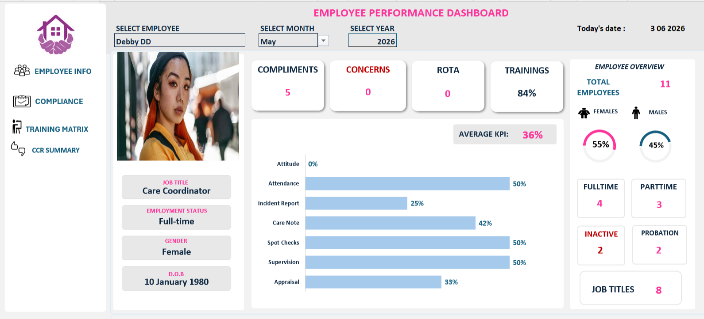
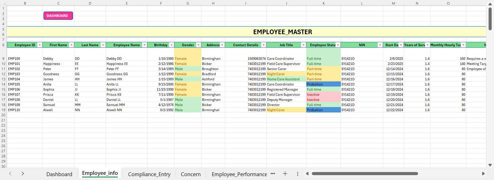
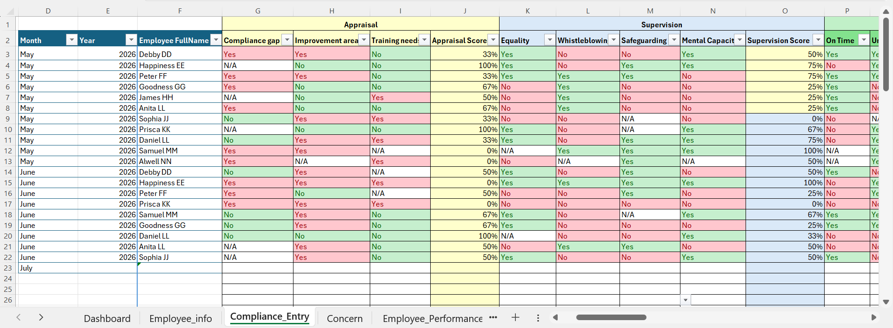
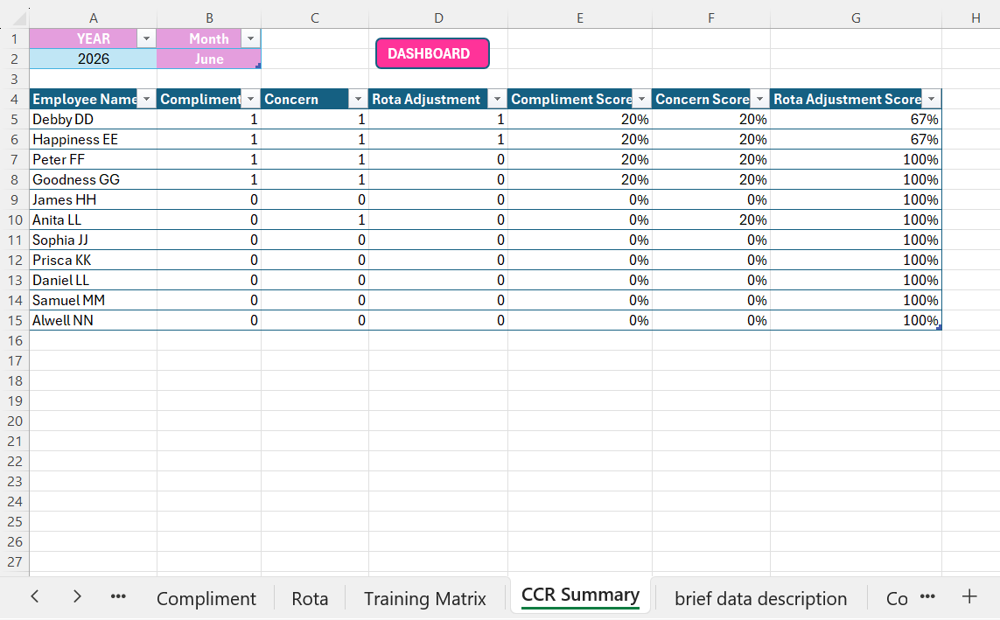
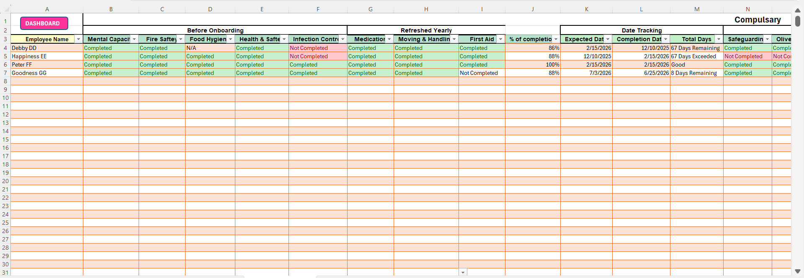
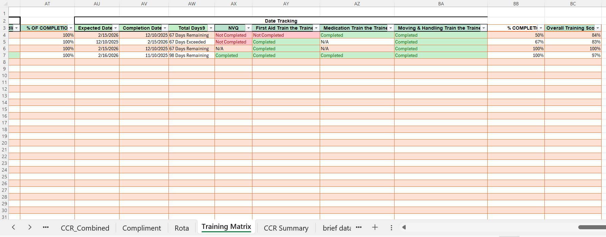
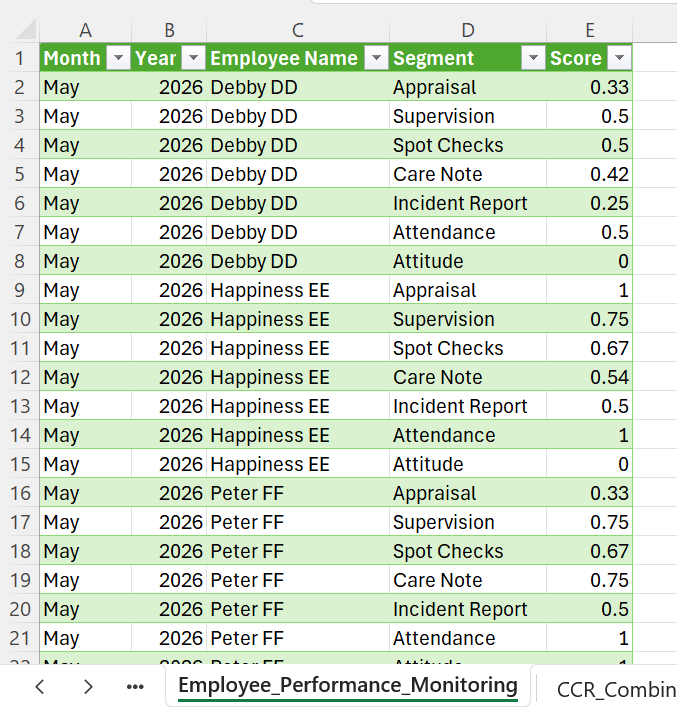
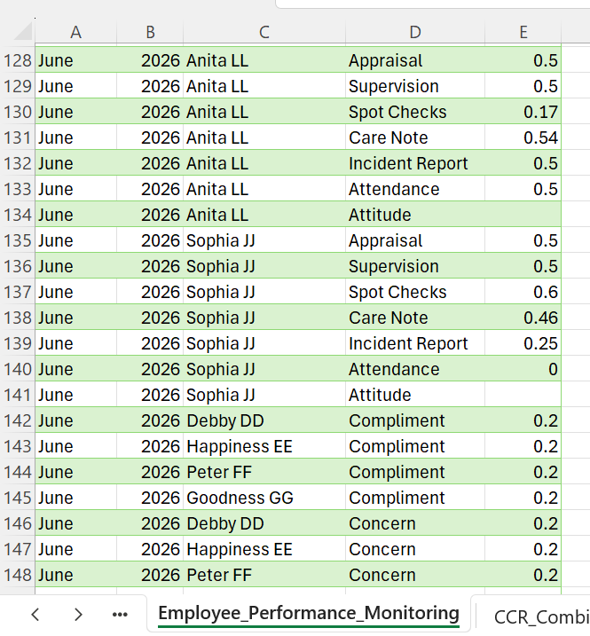

# EMPLOYEE-PERFORMANCE-MANAGEMENT-SYSTEM
An automated Employee Performance Management System built in Microsoft Excel using Power Query and VBA. The system tracks employee compliance, concerns, rota adjustments, KPIs, training records, and generates interactive dashboards with dynamic employee profiles and analytics

## Project Overview
This project is an Employee Performance Management System built in Microsoft Excel for a home care company. It was developed to help the HR team monitor and manage employee performance more efficiently.
The system records and tracks employee compliance, compliments, concerns, rota adjustments, training records, and overall performance. It also includes interactive dashboards that allow managers to view individual employee performance, monitor monthly trends, and generate reports.
Power Query was used to automate data preparation, while VBA was used to display employee photos dynamically. The system reduces manual work, improves record keeping, and makes it easier for management to monitor employee performance and make informed decisions.

## Business Problem
Many employee performance records in home care companies are managed manually using different spreadsheets and documents. This makes it difficult to track employee performance, monitor compliance, and prepare reports.
The company also needed a better way to:
- Track employee compliance and performance.
- Record compliments, concerns, and rota adjustments.
- Monitor staff training records.
- View employee performance in one place.
- Generate monthly performance reports quickly.
- Reduce the time spent on manual reporting and calculations.

As the number of employees and records increased, the existing process became more time-consuming and harder to manage. There was a need for a centralized system that could automate these processes and provide management with clear and accurate performance information.

## Solution Developed
To solve these challenges, I developed an Employee Performance Management System in Microsoft Excel.
The system brings together employee performance information from different sources into one dashboard. It automates data collection, performance calculations, and reporting, making it easier for the HR team to monitor employee performance and make informed decisions.
The solution includes:
- Compliance Entry
- Compliance monitoring and scoring
- Employee compliments tracking
- Employee concerns tracking
- Rota adjustment tracking
- Training records monitoring
- Employee profile with dynamic photo display
- Interactive performance dashboards
- Automated monthly reports

Employee compliments, concerns, and rota adjustments are collected using Google Forms, while Power Query automatically prepares and combines the data for reporting. VBA is used to display employee photos dynamically on the dashboard.

## Screenshots
### Main Dashboard

### Employee Profile

### Compliance Entry

### Compliments, Concerns, and Rota Adjustment (CCR) Summary 

### Training Module - Page 1

### Training Module - Page 2

### Employee Performance Monitoring - Page 1

### Employee Performance Monitoring - Page 2

## Key Features
- Employee Performance Dashboard – View the overall performance of employees through interactive dashboards.
- Compliance Monitoring – Track employee compliance across different performance segments and calculate compliance scores automatically.
- Compliments Tracking – Record and monitor employee compliments submitted through Google Forms.
- Concerns Tracking – Record and monitor employee concerns submitted through Google Forms.
- Rota Adjustment Tracking – Track rota adjustments and include them in employee performance evaluation.
- Training Records – Monitor employee training completion and progress.
- Dynamic Employee Profile – Display employee details and photos automatically when an employee is selected.
- Automated Performance Scoring – Calculate employee performance scores automatically based on predefined rules.
- Interactive Filters – View employee performance by month, year, or individual employee.
- Automated Data Processing – Power Query automatically prepares and combines data from different sources for reporting.
- Real-time Reporting – Generate up-to-date performance reports without manual calculations.

## Workflow
The Employee Performance Management System follows an automated workflow that minimizes manual data processing and ensures that performance reports remain up to date.
1. Managers and staff submit Compliments, Concerns, and Rota (CCR) records through Google Forms.
2. Responses are automatically stored in Google Sheets.
3. Microsoft Excel connects to the Google Sheets data using Power Query.
4. Power Query cleans and transforms the imported data.
5. Compliance Entry records and CCR data are combined into a single **Employee Performance Monitoring** dataset.
6. The Employee Performance dataset serves as the central source for all performance calculations, KPIs, and dashboard visualizations.
7. Excel formulas and VBA automate employee profile updates, performance scoring, and dashboard refreshes.
8. Interactive dashboards and reports provide management with up-to-date insights into employee performance, compliance, and training.

## Project Impact

This system helps the organization manage employee performance more efficiently.
It provides the following benefits:
- Reduces the time spent on manual reporting.
- Brings data from different sources into one system.
- Automatically calculates employee performance scores.
- Makes it easier to track compliance, training, and CCR records.
- Gives managers quick access to employee performance through interactive dashboards.
- Supports faster and better decision-making.
